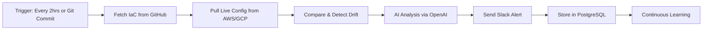

# 🚀 Facets.Cloud Product Management Assignment

> **Author:** Harsh Mishra  
> **Focus Area:** Environment Drift Detection & AI-Powered DevOps Automation

---

## 📋 Table of Contents

- [Overview](#overview)
- [Q1: Understanding Pain Points & Product Vision](#q1-understanding-pain-points--product-vision)
  - [Problem Statement](#problem-statement)
  - [Proposed Feature: SEDD](#proposed-feature-sedd)
  - [Execution Plan](#execution-plan)
- [Q2: Product Execution & Prioritization](#q2-product-execution--prioritization)
  - [AI DriftGuard Agent](#ai-driftguard-agent)
  - [Technical Architecture](#technical-architecture)
- [Q3: DevOps Guestimate](#q3-devops-guestimate)
  - [Deployment Scale Estimation](#deployment-scale-estimation)
  - [Scalability Metrics](#scalability-metrics)
- [Vision Statement](#vision-statement)

---

## 🎯 Overview

This assignment explores how Facets.Cloud can evolve from an environment automation platform into an **intelligent reliability ecosystem** through proactive drift detection and AI-powered remediation.

---

## Q1: Understanding Pain Points & Product Vision

### 🔴 Problem Statement

DevOps engineers and developers managing multiple environments (development, staging, production) face a critical challenge: **environment drift**.

**What is Environment Drift?**
- Configurations across environments gradually become inconsistent
- Caused by manual patches, version mismatches, or direct hotfixes
- Occurs even with automation tools (Terraform, Kubernetes, CI/CD)

**Impact:**
- ❌ Deployment failures ("works on my machine" issues)
- ⏱️ Debugging delays and wasted engineering hours
- 💥 Unstable production environments

**Market Gap:** Existing IDPs (Facets, Humanitec, Zeet) focus on provisioning and deployment but lack **continuous, proactive drift detection** post-deployment.

---

### 💡 Proposed Feature: SEDD

**Feature Name:** Smart Environment Drift Detector (SEDD)

**Goal:** Proactively detect, predict, and remediate environment drift before it causes production failures.

#### Core Functionality

| Feature | Description |
|---------|-------------|
| **Real-time Drift Detection** | Continuously compares live infrastructure with IaC templates (Terraform, Kubernetes, CloudFormation) |
| **AI-Powered Prediction** | Learns from manual edit history and identifies resources most likely to drift |
| **Drift Alerts & Confidence Scoring** | Sends Slack/Dashboard alerts with drift summaries, confidence levels, and one-click remediation |
| **One-Click Reconciliation** | Instantly sync staging and production configurations via Facets CLI or dashboard |

#### Expected Impact

- 📉 **40% fewer** environment-related incidents
- ⚡ **Faster** debugging and deployment turnaround
- 🛡️ **Stronger trust** in Facets as a "proactive reliability platform"

---

### 📝 Execution Plan

#### 1️⃣ Research Phase

- **User Interviews:** Conduct sessions with 10–15 DevOps engineers to document drift-handling workflows and pain points
- **Competitive Audit:** Compare drift management capabilities of Humanitec, Zeet, Spacelift, and Firefly
- **Data Analysis:** Analyze Facets customer logs to identify configuration mismatch frequency

#### 2️⃣ Design Phase

- Create UI mockups showing:
  - Drift alerts
  - Visual diff reports
  - Remediation options
- Use **Figma** for visualization
- Validate flows with 3–5 target users

#### 3️⃣ Validation Phase

- Launch **alpha** within Facets' internal DevOps setups
- Run **closed beta** with 3 enterprise clients maintaining multi-env deployments
- Collect feedback on:
  - Detection accuracy
  - False positives
  - Alert fatigue

#### ✅ Success Criteria

- 🎯 **80%** drift prediction accuracy
- 📊 **40%** reduction in environment-related support tickets
- ⭐ Positive user feedback on alert usability and remediation UX

---

## Q2: Product Execution & Prioritization


### 🤖 AI DriftGuard Agent

**Agent Name:** AI DriftGuard  
**Objective:** Demonstrate how Facets' AI ecosystem can predict, detect, and resolve environment drift automatically.

#### Problem Context

- Current drift detection relies on manual observation or post-failure debugging
- **AI DriftGuard** introduces **predictive reliability** — enabling teams to act before failures happen


  


---

### 🏗️ Technical Architecture

**Platform:** n8n (No-Code Automation)  
**Deployment:** Render

#### Tools Integrated

| Tool | Purpose |
|------|---------|
| **GitHub API** | Fetch IaC templates (Terraform/Kubernetes) |
| **AWS/GCP APIs** | Pull real-time environment configuration data |
| **OpenAI API** | Generate natural-language drift summaries and remediation guidance |
| **Slack Webhooks** | Deliver real-time notifications to teams |
| **PostgreSQL + Google Sheets** | Store historical drift data for model training |

---

### 🔄 Workflow Overview



#### Step-by-Step Process

1. **Trigger**
   - Runs every 2 hours or on new GitHub commit
   - Detects IaC changes in Terraform/Kubernetes YAMLs

2. **Environment Comparison**
   - Fetches current live infra states from AWS/GCP APIs
   - Compares against IaC definitions using JS diff logic node

3. **AI Analysis Layer**
   - OpenAI model (GPT-based) classifies drift type (minor/major/critical)
   - Generates natural-language explanation and suggested fix

4. **Notification & Action**
   - Sends Slack alert with drift summary, severity score, and "Sync via Facets CLI" link

**Example Alert:**
```
🚨 Drift Detected in Production
Resource: EC2 Instance (app-server)
Expected: t3.large | Found: t2.medium
Confidence: 0.93
Suggested Action: Align with Terraform definition
[Sync Now]
```

5. **Learning & Improvement**
   - Stores results in PostgreSQL for continuous drift pattern learning

---

### 🎯 Why It Matters

- ✨ Demonstrates Facets' "AI Agent" framework moving beyond automation into **predictive reliability**
- 💼 Adds measurable business value: reduced downtime, higher trust, faster MTTR
- 🔗 Positions Facets' AI suite (Terraform Agent, K8s Debugger, AI DriftGuard) as **end-to-end reliability assistants**

---

## Q3: DevOps Guestimate

### 📊 Deployment Scale Estimation

**Scenario:** Estimate daily deployments for Facets with customers using microservices architecture.

#### Assumptions

| Parameter | Value |
|-----------|-------|
| Customers | 100 |
| Teams per Customer | 5 |
| Microservices per Team | 10 |
| Avg. Deployments per Service/Day | 3 |

#### Calculation

```
Total Deployments = Customers × Teams × Microservices × Daily Deployments
                  = 100 × 5 × 10 × 3
                  = 15,000 deployments per day
```

**Result:** Facets would handle **~15,000 deployments per day** at this scale.

---

### 📈 Scalability Metrics

| Metric | Why It Matters | Tool/Source |
|--------|----------------|-------------|
| **Deployment Throughput** (per min) | Ensures queue efficiency | Facets internal metrics API |
| **Build Failure Rate** | Indicates infra bottlenecks | CI/CD Logs |
| **Deployment Latency** | Monitors pipeline health | Prometheus + Grafana |
| **Error Logs** (per env) | Detects drift-related anomalies | CloudWatch / ELK Stack |
| **API Response Time** | Validates backend scalability | Datadog / New Relic |

**Threshold Goal:** Maintain **<2% failed deployments** at 15,000/day scale.

---

### ⚙️ Scalability Strategy

- 🔄 Implement **horizontal autoscaling** for deployment orchestrators
- 🛡️ Introduce **circuit breakers** to prevent cascading failures
- 📡 Use **Kafka or Redis Streams** for deployment event queues to handle concurrency
- 🤖 Leverage **drift prediction** (from SEDD) to avoid redeploying unstable configurations

---

## 🌟 Vision Statement

> **"With SEDD and AI DriftGuard, Facets.Cloud evolves from an environment automation platform into an intelligent reliability ecosystem — capable of predicting, preventing, and perfecting infrastructure stability before issues arise."**

---

## 📞 Contact

**Harsh Mishra**  
Product Management Assignment for Facets.Cloud

---

<p align="center">Made with ❤️ for Facets.Cloud</p>
